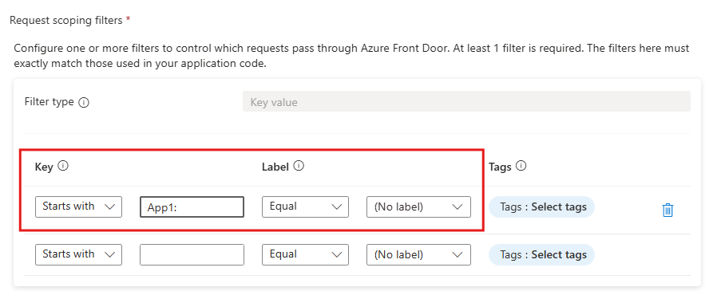
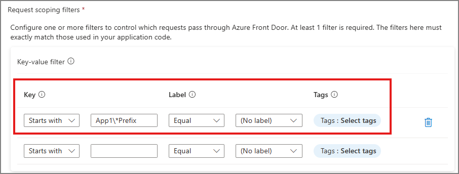
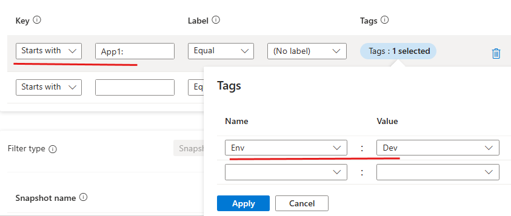

## CDN-Accelerated Configuration Delivery with Azure Front Door

App Configuration gives developers a single, consistent place to define configuration settings and feature flags. By integrating Azure App Configuration with Azure Front Door, your configuration data is centrally managed through Azure App Configuration while being cached and distributed through Azure's content delivery network. This architecture is valuable for client-facing applications including mobile, desktop, and browser-based applications. 

## Documentation links

- Conceptual overview of [Hyperscale Configuration](https://learn.microsoft.com/azure/azure-app-configuration/concept-hyperscale-client-configuration)
- [Connect App Config to Azure Front Door](https://learn.microsoft.com/azure/azure-app-configuration/how-to-connect-azure-front-door)
- [Connect applications to Azure Front Door](https://learn.microsoft.com/azure/azure-app-configuration/how-to-load-azure-front-door-configuration-provider)


## Request scoping filter samples

The key-value filters used by your application must match exactly the filters configured for the Azure Front Door endpoint; any mismatch will cause the request to be rejected. For example, if your endpoint is configured to allow access to keys starting with an "App1:" prefix, the application code must also load keys starting with "App1:". However, if your application loads keys starting with a more specific prefix like "App1:Prod:", the request is rejected.

Here are some examples to help you set up the right filters. 

- [Application uses default key-values](#application-uses-default-key-values)
- [Application uses key-values selector](#application-uses-key-values-selector)
- [Application uses default feature flags](#application-uses-default-feature-flags)
- [Application uses feature flags selector](#application-uses-feature-flags-selector)
- [Application uses key-values and feature flags](#application-uses-key-values-and-feature-flags)
- [Application uses multiple key-value selectors](#application-uses-multiple-key-value-selectors)
- [Application uses key-values and snapshot selectors](#application-uses-key-values-and-snapshot-selectors)
- [Application uses snapshot reference](#application-uses-snapshot-reference)
- [Application loads key-values with reserved characters](#application-loads-key-values-with-reserved-characters)
- [Application loads key-values with tag filters](#application-loads-key-values-with-tag-filters)

### Application uses default key-values

If your application has the following set up:

```cs
builder.Configuration.AddAzureAppConfiguration(options =>
{
    options.ConnectAzureFrontDoor(new Uri("{YOUR-AFD-ENDPOINT}"))
            .ConfigureRefresh(refreshOptions =>
            {
                refreshOptions.RegisterAll()
                    .SetRefreshInterval(TimeSpan.FromMinutes(1));
            });
});
```

Then your Azure Front Door filters should look like this:


| **Filter Type**  | **Operator**  | **Value**   | **Operator**  | **Value**   |
| ---------------- | ------------- | ----------- | ------------- | ----------- |
| Key value        | Key All       | `*`         | Label Equal   | `(No label)`  |


### Application uses key-values selector 

If your application has the following set up with for loading specific key-values:

```cs
builder.Configuration.AddAzureAppConfiguration(options =>
{
    options.ConnectAzureFrontDoor(new Uri("{YOUR-AFD-ENDPOINT}"))
            .Select("App1:*")
            .ConfigureRefresh(refreshOptions =>
            {
                refreshOptions.RegisterAll()
                    .SetRefreshInterval(TimeSpan.FromMinutes(1));
            });
});
```

Then your Azure Front Door filters should look like this:


| **Filter Type**  | **Operator**  | **Value**   | **Operator**  | **Value**   |
| ---------------- | ------------- | ----------- | ------------- | ----------- |
| Key value        | Key Starts with | `App1:`   | Label Equal   | `(No label)`|




-------

### Application uses default feature flags

If your application has the following set up for loading default feature flags:

```cs
builder.Configuration.AddAzureAppConfiguration(options =>
{
    options.ConnectAzureFrontDoor(new Uri("{YOUR-AFD-ENDPOINT}"))
            .UseFeatureFlags(ffOptions =>
            {
                ffOptions.SetRefreshInterval(TimeSpan.FromMinutes(1));
            });
});
```

Then your Azure Front Door filters should look like this:


| **Filter Type**  | **Operator**  | **Value**   | **Operator**  | **Value**   |
| ---------------- | ------------- | ----------- | ------------- | ----------- |
| Key value        | Key All       | `*`         | Label Equal   | `(No label)` |
| Key value        | Key Starts with | `.appconfig.featureflag/` | Label Equal  | `(No label)`  |

-------

### Application uses feature flags selector

If your application has the following set up for loading specific feature flags:

```cs
builder.Configuration.AddAzureAppConfiguration(options =>
{
    options.ConnectAzureFrontDoor(new Uri("{YOUR-AFD-ENDPOINT}"))
            .UseFeatureFlags(ffOptions =>
            {
                ffOptions.Select("MyFeatures*")
                    .SetRefreshInterval(TimeSpan.FromMinutes(1));
            });
});
```

Then your Azure Front Door filters should look like this:


| **Filter Type**  | **Operator**  | **Value**   | **Operator**  | **Value**   |
| ---------------- | ------------- | ----------- | ------------- | ----------- |
| Key value        | Key All       | `*`     | Label Equal   | `(No label)`  |
| Key value        | Key Starts with | `.appconfig.featureflag/MyFeatures`  | Label Equal   | `(No label)`  |

-------

### Application uses key-values and feature flags

If your application has the following set up for loading key-values and feature flags:

```cs
builder.Configuration.AddAzureAppConfiguration(options =>
{
    options.ConnectAzureFrontDoor(new Uri("{YOUR-AFD-ENDPOINT}"))
            .Select("App1:*")
            .ConfigureRefresh(refreshOptions =>
            {
                refreshOptions.RegisterAll()
                    .SetRefreshInterval(TimeSpan.FromMinutes(1));
            })
            .UseFeatureFlags(ffOptions =>
            {
                ffOptions.Select("MyFeatures*")
                    .SetRefreshInterval(TimeSpan.FromMinutes(1));
            });
});
```

Then your Azure Front Door filters should look like this:


| **Filter Type**  | **Operator**  | **Value**   | **Operator**  | **Value**   |
| ---------------- | ------------- | ----------- | ------------- | ----------- |
| Key value        | Key Starts with | `App1:`     | Label Equal   | `(No label)`  |
| Key value        | Key Starts with | `.appconfig.featureflag/MyFeatures`  | Label Equal   | `(No label)`  |

-------

### Application uses multiple key-value selectors

If your application has the following set up with multiple selectors:

```cs
builder.Configuration.AddAzureAppConfiguration(options =>
{
    options.ConnectAzureFrontDoor(new Uri("{YOUR-AFD-ENDPOINT}"))
            .Select("App1:*")
            .Select("Global*", "App1Label")
            .ConfigureRefresh(refreshOptions =>
            {
                refreshOptions.RegisterAll()
                    .SetRefreshInterval(TimeSpan.FromMinutes(1));
            });
});
```

Then your Azure Front Door filters should look like this:

| **Filter Type**  | **Operator**  | **Value**   | **Operator**  | **Value**   |
| ---------------- | ------------- | ----------- | ------------- | ----------- |
| Key value        | Key Starts with | `App1:`     | Label Equal   | `(No label)`  |
| Key value        | Key Starts with | `Global`  | Label Equal   | `App1Label`  |

-------

### Application uses key-values and snapshot selectors

If your application has the following set up with key-values and snapshot:

```cs
builder.Configuration.AddAzureAppConfiguration(options =>
{
    options.ConnectAzureFrontDoor(new Uri("{YOUR-AFD-ENDPOINT}"))
            .Select("App1:*")
            .SelectSnapshot("MySnapshot")
            .ConfigureRefresh(refreshOptions =>
            {
                refreshOptions.RegisterAll()
                    .SetRefreshInterval(TimeSpan.FromMinutes(1));
            });
});
```

Then your Azure Front Door filters should look like this:

| **Filter Type**  | **Operator**  | **Value**   | **Operator**  | **Value**   |
| ---------------- | ------------- | ----------- | ------------- | ----------- |
| Key value        | Key Starts with | `App1:`     | Label Equal   | `(No label)`  |
| Snapshot         | Snapshot name | `MySnapshot`  | -   | -  |

-------

### Application uses snapshot reference

If your application loads a key-value that is a [snapshot reference](https://learn.microsoft.com/azure/azure-app-configuration/concept-snapshot-references), Azure Front Door must be configured to allowlist the referenced snapshot. Include the snapshot name in your Azure Front Door filters to enable snapshot resolution. For example, if you have the following set up:

```cs
builder.Configuration.AddAzureAppConfiguration(options =>
{
    options.ConnectAzureFrontDoor(new Uri("{YOUR-AFD-ENDPOINT}"))
            .Select("App1:*")
            .ConfigureRefresh(refreshOptions =>
            {
                refreshOptions.RegisterAll()
                    .SetRefreshInterval(TimeSpan.FromMinutes(1));
            });
});
```

Lets say, one of the loaded key-values is a snapshot reference that looks like this:

```json
{
    "key": "App1:MySnapshotReference",
    "label": null,
    "value": "{\"snapshot_name\":\"snapshot1\"}",
    "content_type": "application/json; profile=\"https://azconfig.io/mime-profiles/snapshot-ref\"; charset=utf-8",
    "tags": {}
}
```

Then you need to add "snapshot1" to your Azure Front Door filters, in addition to the key-value filter.

| **Filter Type**  | **Operator**  | **Value**   | **Operator**  | **Value**   |
| ---------------- | ------------- | ----------- | ------------- | ----------- |
| Key value        | Key Starts with | `App1:`    | Label Equal   | `(No label)`  |
| Snapshot         | Snapshot name | `snapshot1`   | -   | -  |

-------

### Application loads key-values with reserved characters

If your application has the following set up where your key filter contains [App Config reserved characters](https://aka.ms/azconfig/docs/keyvaluefiltering):

```cs
builder.Configuration.AddAzureAppConfiguration(options =>
{
    options.ConnectAzureFrontDoor(new Uri("{YOUR-AFD-ENDPOINT}"))
            .Select("App1\\*Prefix*")
            .ConfigureRefresh(refreshOptions =>
            {
                refreshOptions.RegisterAll()
                    .SetRefreshInterval(TimeSpan.FromMinutes(1));
            });
});
```

Then your Azure Front Door filters should look like this:

| **Filter Type**  | **Operator**  | **Value**   | **Operator**  | **Value**   |
| ---------------- | ------------- | ----------- | ------------- | ----------- |
| Key value        | Key Starts with | `App1\*Prefix`     | Label Equal   | `(No label)`  |




-------

### Application loads key-values with tag filters

If your application has the following set up with tag filters:

```cs
builder.Configuration.AddAzureAppConfiguration(options =>
{
    options.ConnectAzureFrontDoor(new Uri("{YOUR-AFD-ENDPOINT}"))
            .Select("App1:*", tagFilters: new[] { "Env=Dev" })
            .ConfigureRefresh(refreshOptions =>
            {
                refreshOptions.RegisterAll()
                    .SetRefreshInterval(TimeSpan.FromMinutes(1));
            });
});
```

Then your Azure Front Door filters should look like this:

| **Filter Type**  | **Operator**  | **Value**   | **Operator**  | **Value**   | **Operator**  | **Value**   |
| ---------------- | ------------- | ----------- | ------------- | ----------- | ------------- | ----------- |
| Key value        | Key Starts with | `App1:`     | Label Equal   | `(No label)`  | Tags          | Name: `Env`, Value: `Dev` |



-------

## Sample Applications

- [.NET MAUI](https://github.com/Azure-Samples/appconfig-maui-app-with-afd/blob/main/README.md)
- [JavaScript](https://github.com/Azure-Samples/appconfig-javascript-clientapp-with-afd/blob/main/README.md)
