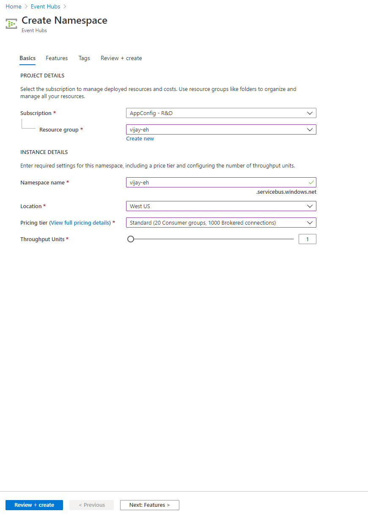
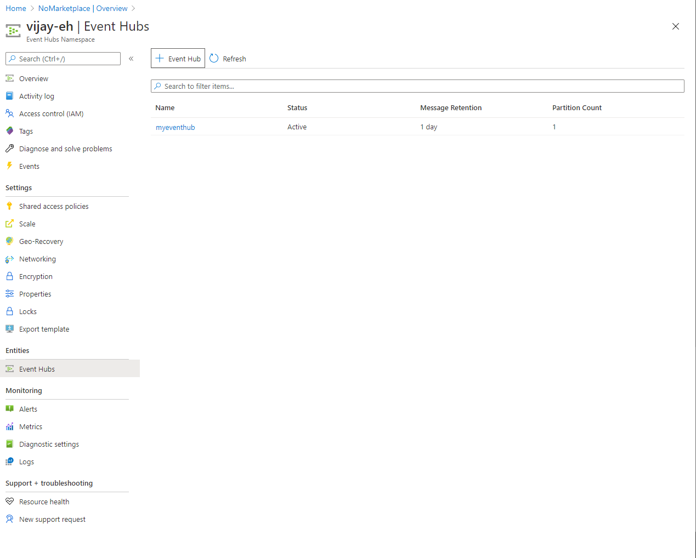
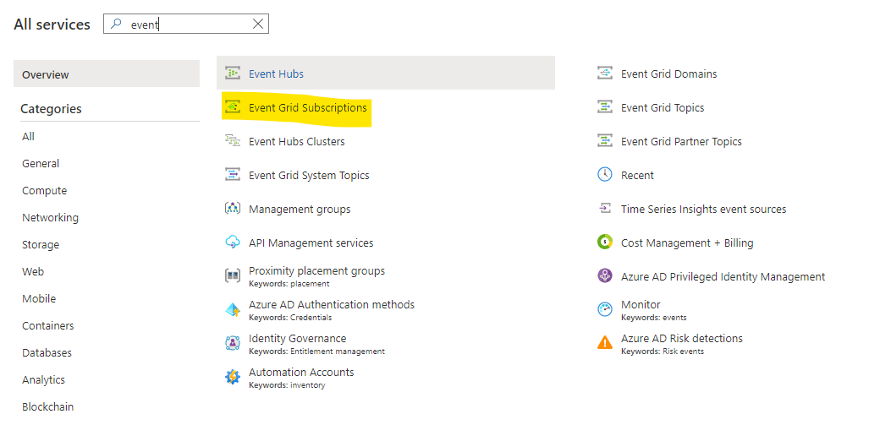
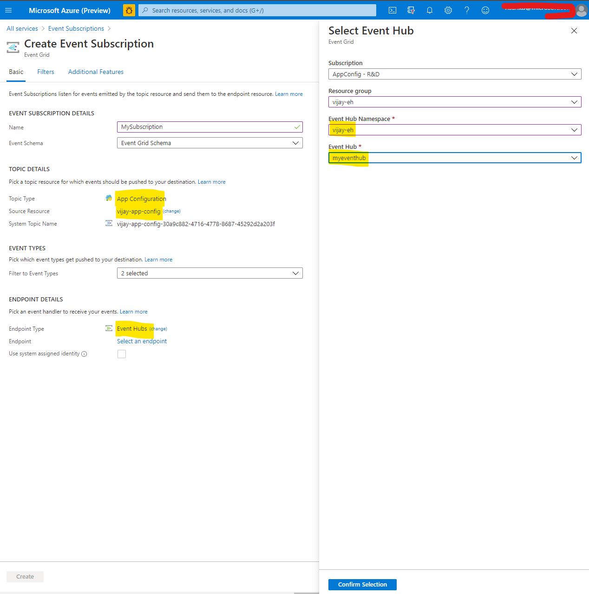
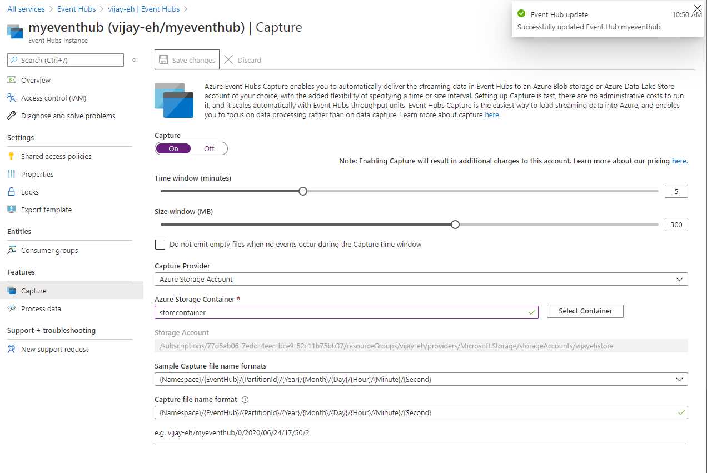

# Integrate Azure App Configuration with Azure Event Hub

## Create Event Hub Subscription

### Create Event Hub Namespace

On the Portal, create an Event Hub Namespace in any resource group as shown:

### Create an Event Hub in the Namespace

Once the namespace has been created, create an Event Hub that will receive the events and notify your app as shown:

### Create Event Grid Subscription

Once the Event Hub Namespace and the Event Hub are created, you can then connect it to the Event Grid Subscription.
- Create a new Azure Event Grid Subscription Resource as shown:

- During the creation process, be sure to select the "App Configuration" topic type and select the App Configuration Store in its appropriate Resource Group. Next, select "Event Hub" as the Endpoint Type and select the Event Hub Namespace and the Event Hub created above in its Resource Group:

### Next Create (or use existing) Azure Storage Container to Capture Events

Next, you'll need a storage container to capture events to the Event Hub. From the Event Hub resource created above, go to "Capture" and turn on "Capture" and create a new (or select an existing Storage Container) as shown:
