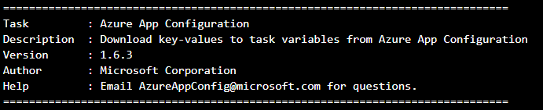

## Azure App Configuration Extension release notes

> **DEPRECATION NOTICE**  
> This pipeline task is now available as a built-in task for Azure Pipelines under the new name, **Azure App Configuration Export**. This means you no longer need to install it from Marketplace. While you can continue using the Marketplace version, please note that it will no longer receive updates. Transitioning to the new built-in task requires minimal effort, as it supports all the features and functionalities of the Marketplace version. In most cases, it is as simple as updating the task name and version in your pipeline.
>
> Upgrade to [Azure App Configuration Export](https://learn.microsoft.com/azure/azure-app-configuration/azure-pipeline-export-task) today to access the latest features and improvements.

The Azure App Configuration extension in Azure DevOps pipeline has been published to [Azure DevOps marketplace](https://marketplace.visualstudio.com/items?itemName=AzureAppConfiguration.azure-app-configuration-task&ssr=false#overview). The version of the Azure App Configuration task being used will print to the console when the task is executed: 

### v8.0.0 - July, 3, 2024
- Added support for Node.js 20. This pipeline task now supports both Node.js 16 and Node.js 20.

### v7.0.0 - November, 20 2023
**Breaking changes**
  - Updated to fail the task if any Key Vault references cannot be resolved or if the resolved values are unable to be set as a pipeline secret. To avoid failing the task due to Key Vault errors, you can enable the new option to treat these errors as warnings detailed below.

**Enhancement**
  - Added an option to treat Key Vault resolution errors as warnings.

### v6.5.0 - October, 13 2023
* Added capability to use workload identity federation for authentication.

### v6.0.0 - February, 02 2023
**Breaking changes**
  - Updated the task to require Node.js 16. It previously required 10.
  - Updated the minimum supported azure pipeline agent version to [2.206.1](https://github.com/microsoft/azure-pipelines-agent/releases/tag/v2.206.1) or later. Previously it was [2.144.0](https://github.com/microsoft/azure-pipelines-agent/releases/tag/v2.144.0).

**Bug Fixes**
  - Fixed a bug that caused an invalid secret URL warning when resolving key vault references in sovereign clouds.

### v5.2.0 - March, 02 2022
Fixed a bug that caused an invalid_client error when using certificate-based authentication [#608](https://github.com/Azure/AppConfiguration/issues/608).

### v5.1.0 - January, 07 2022
* **Breaking change**: 
With the added support of sovereign clouds such as Azure Government and Azure China, the task inputs were updated.

  **Before**: 
  Task input was *App Configuration Name*

  **After**:
  Task input was updated to *App Configuration endpoint*. The *App Configuration endpoint* can be gotten from the App Configuration store overview page.

### v4.0.0 - October, 12 2021
* Upgraded task to use Node 10. It previously used Node 6.

### v3.5.16 - July, 22 2021
* Added the capability to use certificate based authentication.
* Added logs that show more details with reference to parameters used to run the task.
* Fixed a bug that caused the warning "Can\'t find loc string for key:CouldNotFetchAccessTokenforAzureStatusCode causes app config azdo task to fail" [#520](https://github.com/Azure/AppConfiguration/issues/520). 

### v3.4.16 - March, 12 2021
* Added the capability to use managed identity based authentication.

### v3.3.16 - February, 16 2021
* Fixed incorrect tooltip help messages for task parameters in task editor UI [#447](https://github.com/Azure/AppConfiguration/issues/447) 
* Updated error message when certificate based authentication is used to indicate that it is not supported.

### v3.2.16 - December, 10 2020
* Updated the readme 

### v3.2.15 - December, 10 2020
* Fixed an issue causing the task to partially succeed when key-values are overwritten [#372](https://github.com/Azure/AppConfiguration/issues/372)
* Improved error message when required parameters are not provided 

### v3.0.14 - May, 15 2020
* Fixed an issue causing the task to fail when run in a Linux pipeline. [#327](https://github.com/Azure/AppConfiguration/issues/327)

### v3.0.13 - May, 04 2020
* Fixed the issue that some symbols, for example, percent sign (%), could not be set to Pipeline Task variables correctly. [#313](https://github.com/Azure/AppConfiguration/issues/313)

### v2.0.11 - March, 24 2020
* The Azure App Configuration pipeline task for the Azure DevOps is now generally available.
* Added `FAQ` section to the [documentation](https://marketplace.visualstudio.com/items?itemName=AzureAppConfiguration.azure-app-configuration-task).  

### v2.0.10 - March, 21 2020
* Added support for trimming key prefixes before setting as pipeline variables.
* Added support for resolving Key Vault references and setting as pipeline secrets.

### v2.0.9 - January, 21 2020
* **Breaking change**: With the support of Role-Based Access Control (RBAC) by the App Configuration service, the permission of this pipeline task can be granted with more granular and specific access control.

  **Before**
  The *Service Connection* of this pipeline task is granted `Contributor` role in access control of the App Configuration store.

  **After**
 The *Service Connection* of this pipeline task is granted `Azure App Configuration Data Reader` role in access control of the App Configuration store.

### v1.6.8 - December, 02 2019
  * Fixed the issue that the `App Configuration name` dropdown is not populated if the App Configuration pipeline task is added to the pipeline YAML file via the `assistant` UI of Tasks. [#202](https://github.com/Azure/AppConfiguration/issues/202)

### v1.6.7 - September, 04 2019
  * Updated to use the authorization header syntax that is compliant with the REST API spec.
  * Included API version for all requests sent to Azure App Configuration.

### v1.6.6 - June, 24 2019
* Improved [homepage documentation](https://marketplace.visualstudio.com/items?itemName=AzureAppConfiguration.azure-app-configuration-task):
  * Added a link to this release notes.
  * Added an example of how to consume fetched key-values.

### v1.6.3 - June, 03 2019
* Added support for auto-populated `App Configuration name` dropdown from a textbox.
* Reset environment variables with invalid keys now prints a masked value, `****`, instead of the actual value of the key-value.

### v1.4.48 - May, 06 2019
* Initial version.
* Added Azure App Configuration Extension to [Azure DevOps Marketplace](https://marketplace.visualstudio.com/).
* Integrated with pipeline framework control `Azure subscription` so that user could use existing `Connection Endpoint` to auth with Azure App Configuration instance.
* Added support for `Key filter` and `Label` to query matched key-values.

