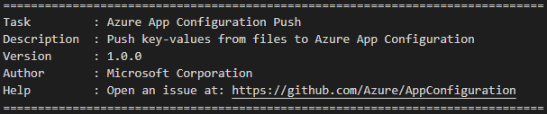

## Azure App Configuration Push Extension release notes
Azure App Configuration Push extension for Azure DevOps pipeline can be installed from the [Azure DevOps marketplace](https://marketplace.visualstudio.com/items?itemName=AzureAppConfiguration.azure-app-configuration-task-push). The version information can be found in the console when the task is executed:

### v1.1.4 - December, 10 2020
* Updated the readme 

### v1.1.3 - December, 10 2020
* Improved error message when required parameters are not provided. 

### v1.0.0 Preview - July, 19 2020
* Initial version.
* Added Azure App Configuration Push extension to [Azure DevOps Marketplace](https://marketplace.visualstudio.com/items?itemName=AzureAppConfiguration.azure-app-configuration-task-push).
