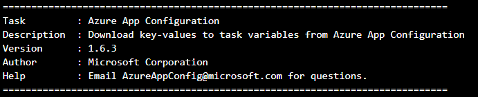

## Azure App Configuration Extension release notes

The Azure App Configuration extension in Azure DevOps pipeline has been published to [Azure DevOps marketplace](https://marketplace.visualstudio.com/items?itemName=AzureAppConfiguration.azure-app-configuration-task&ssr=false#overview). The version is printed out to console in the step of running the Azure App Configuration extension: 

### 1.6.3
* Fix case insensitive for keys in the Azure App Configuration extension side.
* Support auto-populated `App Configuration name` dropdown from a textbox.
* Fix framework forcing to print out any key-values when failed to set as environment variables; the extension only prints key with a mask value `****` if process failed to set as environment variable.

### Initial version
* Add Azure App Configuration Extension to [Azure DevOps Marketplace](https://marketplace.visualstudio.com/).
* Integrate with pipeline framework control `Azure subscription` so that user could use existing `Connection Endpoint` to auth with Azure App Configuration instance.
* Support `Key filter` and `Label` to query matched key-values.

